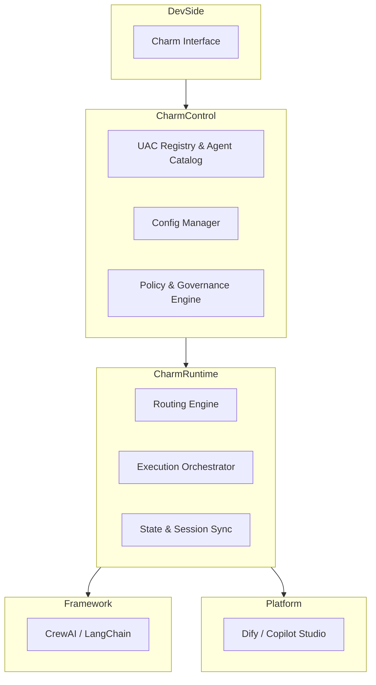
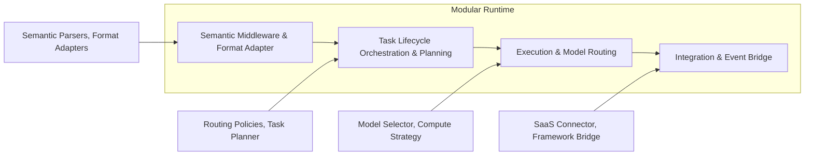

# Welcome to Charm

Charm is an open-source, modular, and framework-neutral AI operating system that enables developers to compose, deploy, and scale AI agents across different frameworks, tools, and platforms through a unified API and a plugin-based architecture. All agents can be developed and executed on a single open platform, collaborating, interoperating, and evolving seamlessly.

Our mission is to eliminate the fragmentation of today’s AI development and execution environments, empowering agent-based applications to grow into a truly interconnected ecosystem — one that ultimately becomes a natural part of human society.

## Architecture

Pluggable Orchestration & Execution:
All tasks flow through a unified orchestration pipeline, where major subsystems expose plugin interfaces that allow you to inject or swap components (e.g., model routers, workflow planners, or SDK bridges) to compose workflows tailored to custom requirements

